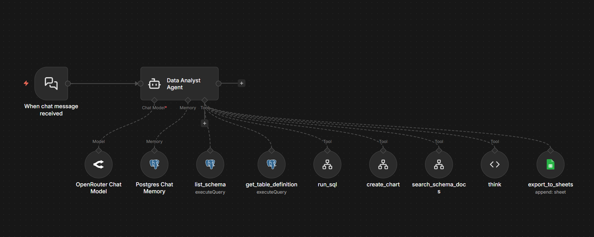

# n8n AI Agents

A curated catalog of production-ready n8n workflow templates for AI agents. Every template follows the same architectural principles, security framework, and output conventions — so learning one teaches you the rest.

   

---

## Templates

### 🟢 Supabase / Postgres Data Analyst

> Natural-language analytics chatbot over any Supabase or Postgres database. The agent introspects your schema, writes SQL, runs it safely, and returns answers with charts.

**Stack:** n8n · LangChain Tools Agent · Claude Sonnet 4.6 (OpenRouter) · Postgres Chat Memory · QuickChart

**Tools:** `list_schema` · `get_table_definition` · `run_sql` · `create_chart` · `search_schema_docs` · `think` · `export_to_sheets`

**[→ Open repo](https://github.com/MinaSaad1/n8n-supabase-data-analyst-agent)** · [Architecture](https://github.com/MinaSaad1/n8n-supabase-data-analyst-agent/blob/main/docs/ARCHITECTURE.md) · [Security](https://github.com/MinaSaad1/n8n-supabase-data-analyst-agent/blob/main/docs/SECURITY.md) · [Demo script](https://github.com/MinaSaad1/n8n-supabase-data-analyst-agent/blob/main/docs/DEMO_SCRIPT.md)

---

### 🟡 Power BI Data Analyst

> Same idea, but over a Power BI semantic model. Agent writes DAX, hits the REST `executeQueries` API, and respects your existing measures instead of re-deriving them.

**Stack:** n8n · LangChain Tools Agent · Claude Sonnet 4.6 (OpenRouter) · Microsoft OAuth2 (Service Principal) · Power BI REST API · QuickChart

**Tools:** `list_tables_and_measures` · `get_table_columns` · `run_dax` · `create_chart` · `refresh_dataset` · `think`

**[→ Open repo](https://github.com/MinaSaad1/n8n-powerbi-data-analyst-agent)** · [Architecture](https://github.com/MinaSaad1/n8n-powerbi-data-analyst-agent/blob/main/docs/ARCHITECTURE.md) · [Security](https://github.com/MinaSaad1/n8n-powerbi-data-analyst-agent/blob/main/docs/SECURITY.md) · [Azure AD Setup](https://github.com/MinaSaad1/n8n-powerbi-data-analyst-agent/blob/main/docs/AZURE_AD_SETUP.md)

---

### 🔥 Marco's Lead Hunter (Firecrawl Web Crawler Agent)

> **n8n April 2026 Community Challenge submission — Case 3 (Advanced ⭐⭐⭐).** Weekly scheduled agent that finds local businesses with thriving reviews but outdated websites, enriches each with 10+ signals, computes a composite lead score, generates personalized pitch email drafts, upserts into Postgres, and emails Marco a Monday-morning digest with 5 ready-to-send outreach cards.

**Stack:** n8n Schedule Trigger · LangChain Tools Agent · Claude Sonnet 4.6 (OpenRouter) · Firecrawl v1 API (9 ops) · Postgres CRM (`marco_leads` / `marco_runs`) + Credit Ledger + 24h Scrape Cache · Gmail HTML digest

**Tools:** `search_web` · `map_site` · `scrape_url` · `batch_scrape` · `extract_data` · `firecrawl_autopilot` · `browser_session` · `check_credits` · `think`

**[→ Open folder](./n8n-firecrawl-web-crawler-agent)** · [Case 3 submission doc](./n8n-firecrawl-web-crawler-agent/docs/MARCO_CASE.md) · [Architecture](./n8n-firecrawl-web-crawler-agent/docs/ARCHITECTURE.md) · [Demo script](./n8n-firecrawl-web-crawler-agent/docs/DEMO_SCRIPT.md) · [Security](./n8n-firecrawl-web-crawler-agent/docs/SECURITY.md) · [Credit management](./n8n-firecrawl-web-crawler-agent/docs/CREDIT_MANAGEMENT.md)

> Bonus: ships with generic chat + webhook variants that expose the same 9 Firecrawl tools for ad-hoc research use. Not part of the challenge submission — companion infrastructure demonstrating the sub-workflow substrate.

---

## n8n for Non-Techies playbook

Ten kits for operators who want automation without writing code. Each repo ships a single n8n workflow JSON, a plain-English README, an architecture write-up, and a security framework. Use one, learn the pattern, ship the next.

### 1️⃣ Weekly KPI Briefing

> Stop pulling the same Monday morning numbers by hand. Scheduled n8n workflow runs your KPI queries against Postgres, formats the digest as HTML and plain text, and hands off to your delivery node of choice.

**Stack:** n8n Schedule Trigger · Postgres · Set / Split / Aggregate / Code · delivery node of your choice (Slack, Gmail, Notion, Resend)

**Components:** cron schedule · array of `{label, sql}` definitions · per-query execution · digest formatter

**[→ Open repo](https://github.com/MinaSaad1/n8n-weekly-kpi-briefing)** · [Architecture](https://github.com/MinaSaad1/n8n-weekly-kpi-briefing/blob/main/docs/ARCHITECTURE.md) · [Security](https://github.com/MinaSaad1/n8n-weekly-kpi-briefing/blob/main/docs/SECURITY.md) · [Setup](https://github.com/MinaSaad1/n8n-weekly-kpi-briefing/blob/main/docs/SETUP.md)

---

### 2️⃣ Lead Enrichment

> Webhook-triggered n8n workflow that takes a form submission, runs Claude qualification, tags hot/warm/cold, and writes to your CRM with a Slack ping. Under 60 seconds per lead.

**Stack:** n8n Webhook · Claude Sonnet 4.6 (Anthropic / OpenRouter) · Google Sheets or Airtable · Slack

**Components:** form webhook · field extraction · Claude qualification chain · CRM write · Slack notify

**[→ Open repo](https://github.com/MinaSaad1/n8n-lead-enrichment)** · [Architecture](https://github.com/MinaSaad1/n8n-lead-enrichment/blob/main/docs/ARCHITECTURE.md) · [Security](https://github.com/MinaSaad1/n8n-lead-enrichment/blob/main/docs/SECURITY.md)

---

### 3️⃣ Email Triage Agent

> Gmail-polling n8n workflow that classifies every incoming email with Claude, drafts replies for the right ones, and routes alerts to Slack. You review, you don't triage.

**Stack:** n8n Gmail Trigger · Claude Haiku 4.5 (OpenRouter) · LangChain chain · Slack

**Components:** Gmail polling · single-call categorize plus draft · priority routing · optional label and mark-as-read

**[→ Open repo](https://github.com/MinaSaad1/n8n-email-triage)** · [Architecture](https://github.com/MinaSaad1/n8n-email-triage/blob/main/docs/ARCHITECTURE.md) · [Security](https://github.com/MinaSaad1/n8n-email-triage/blob/main/docs/SECURITY.md)

---

### 4️⃣ Content Repurposing

> Webhook-triggered n8n workflow that turns one long-form URL into a LinkedIn post, newsletter section, and tweet thread via Claude. Two-hour repurposing job becomes a ten-minute review.

**Stack:** n8n Webhook · Jina.ai Reader (free) · Claude Sonnet 4.6 · Google Docs · Slack

**Components:** URL ingestion · Jina reader extraction · single Claude call returning 3 formats · Docs append · Slack notify

**[→ Open repo](https://github.com/MinaSaad1/n8n-content-repurposing)** · [Architecture](https://github.com/MinaSaad1/n8n-content-repurposing/blob/main/docs/ARCHITECTURE.md) · [Security](https://github.com/MinaSaad1/n8n-content-repurposing/blob/main/docs/SECURITY.md)

---

### 5️⃣ Meeting Notes to Tasks

> Webhook-triggered n8n workflow that takes a meeting transcript, extracts action items with owners and due dates via Claude, writes them to Notion, and drafts a follow-up email.

**Stack:** n8n Webhook · Claude Sonnet 4.6 · Notion · Slack · Gmail draft

**Components:** transcript ingestion · structured extraction (actions, decisions, open questions, summary) · Notion task creation · email draft · Slack recap

**[→ Open repo](https://github.com/MinaSaad1/n8n-meeting-notes-to-tasks)** · [Architecture](https://github.com/MinaSaad1/n8n-meeting-notes-to-tasks/blob/main/docs/ARCHITECTURE.md) · [Security](https://github.com/MinaSaad1/n8n-meeting-notes-to-tasks/blob/main/docs/SECURITY.md)

---

### 6️⃣ Review Monitoring

> Scheduled n8n workflow that polls for new reviews across multiple platforms, classifies sentiment with Claude, drafts responses for negatives, and pings Slack within the hour.

**Stack:** n8n Schedule Trigger · SerpAPI (or Google CSE / Bing) · Reddit API · Claude Sonnet 4.6 · Slack · Airtable · Gmail (optional escalation)

**Components:** multi-source review search · sentiment classification · negative-first alerting · response drafting

**[→ Open repo](https://github.com/MinaSaad1/n8n-review-monitoring)** · [Architecture](https://github.com/MinaSaad1/n8n-review-monitoring/blob/main/docs/ARCHITECTURE.md) · [Security](https://github.com/MinaSaad1/n8n-review-monitoring/blob/main/docs/SECURITY.md) · [Setup](https://github.com/MinaSaad1/n8n-review-monitoring/blob/main/docs/SETUP.md)

---

### 7️⃣ Invoice PDF to Sheets

> Drive-watched n8n workflow that extracts vendor, invoice number, date, line items, subtotal, tax, and total from any invoice PDF using Claude Vision, then writes a row to your accounting sheet within 60 seconds.

**Stack:** n8n Google Drive Trigger · Claude Vision · Google Sheets · Slack (optional)

**Components:** Drive folder watch · base64 PDF prep · vision extraction · duplicate check · Sheets append

**[→ Open repo](https://github.com/MinaSaad1/n8n-invoice-pdf-to-sheets)** · [Architecture](https://github.com/MinaSaad1/n8n-invoice-pdf-to-sheets/blob/main/docs/ARCHITECTURE.md) · [Security](https://github.com/MinaSaad1/n8n-invoice-pdf-to-sheets/blob/main/docs/SECURITY.md) · [Setup](https://github.com/MinaSaad1/n8n-invoice-pdf-to-sheets/blob/main/docs/SETUP.md)

---

### 8️⃣ AI-Qualified Booking

> Webhook-triggered n8n workflow that gates Calendly behind Claude-powered ICP scoring. Only qualified prospects book your calendar. Borderline cases route to manual review. Not-a-fit gets a polite decline with alternatives.

**Stack:** n8n Webhook · Claude Sonnet 4.6 · Calendly (gated) · Gmail · Google Sheets / Airtable · Slack

**Components:** intake form ingestion · ICP scoring against your criteria · routing into qualified / borderline / not-a-fit · email per path · CRM logging

**[→ Open repo](https://github.com/MinaSaad1/n8n-ai-qualified-booking)** · [Architecture](https://github.com/MinaSaad1/n8n-ai-qualified-booking/blob/main/docs/ARCHITECTURE.md) · [Security](https://github.com/MinaSaad1/n8n-ai-qualified-booking/blob/main/docs/SECURITY.md) · [Setup](https://github.com/MinaSaad1/n8n-ai-qualified-booking/blob/main/docs/SETUP.md)

---

### 9️⃣ Social Mention Digest

> Daily n8n workflow that aggregates brand mentions across Google, Reddit, and X, classifies sentiment with Claude, and ships a Slack digest grouped by negative-first.

**Stack:** n8n Schedule Trigger · SerpAPI / Google CSE · Reddit API · Claude Sonnet 4.6 · Slack · Airtable · Gmail (optional)

**Components:** multi-source mention search · sentiment classification · digest builder (negative-first) · Slack delivery · log to Airtable

**[→ Open repo](https://github.com/MinaSaad1/n8n-social-mention-digest)** · [Architecture](https://github.com/MinaSaad1/n8n-social-mention-digest/blob/main/docs/ARCHITECTURE.md) · [Security](https://github.com/MinaSaad1/n8n-social-mention-digest/blob/main/docs/SECURITY.md) · [Setup](https://github.com/MinaSaad1/n8n-social-mention-digest/blob/main/docs/SETUP.md)

---

### 🔟 Customer Onboarding Flow

> Webhook-triggered n8n workflow that runs a 30-day customer onboarding sequence with NPS branching. Welcome on Day 0, check-in Day 3, friction survey Day 7, human touchpoint Day 14 if needed, NPS plus referral ask Day 30.

**Stack:** n8n Webhook (CRM or Stripe) · Claude Sonnet 4.6 · Gmail · Notion · Slack · IF / Wait nodes

**Components:** customer event ingestion · timed sequence · friction survey branching · NPS routing (promoter / detractor)

**[→ Open repo](https://github.com/MinaSaad1/n8n-customer-onboarding)** · [Architecture](https://github.com/MinaSaad1/n8n-customer-onboarding/blob/main/docs/ARCHITECTURE.md) · [Security](https://github.com/MinaSaad1/n8n-customer-onboarding/blob/main/docs/SECURITY.md) · [Setup](https://github.com/MinaSaad1/n8n-customer-onboarding/blob/main/docs/SETUP.md)

---

## Shared principles

All templates in this catalog follow the same patterns. Rather than duplicate these across every template's docs, the canonical versions live here:

- [**Architecture Principles**](docs/architecture-principles.md) — The Tools Agent shape, why sub-workflows for `run_*` and `create_chart`, primitive-based chart interfaces, memory handling, `think` tool rationale
- [**Security Framework**](docs/security-framework.md) — The layered defense model: auth → identity passthrough → data-source RLS → scoped roles → PII masking → query guards → audit/rate limit → output filter → cost caps → memory hygiene
- [**Output Conventions**](docs/output-conventions.md) — Strict markdown output format (bold headline → chart → pipe-table → query → observations), number formatting rules
- [**Testing Guide**](docs/testing-guide.md) — How to validate an imported template end-to-end, common failure modes, debugging via n8n's Executions panel
- [**Contributing**](docs/contributing.md) — For new templates: expected file structure, required docs, naming conventions, submission checklist

## Why these templates?

Most "AI agent + n8n" tutorials demo a single tool and call it done. These templates go further:

- **Schema-aware** — the agent introspects what exists before writing queries. No hallucinated table/column names.
- **Safe by default** — read-only access, row caps, explicit write authorization. Not production-secure out of the box (see the security framework), but the right starting point.
- **Visual by default** — 80%+ of responses include a chart. Users see trends, not just numbers.
- **Memory that works** — Postgres-backed conversation history keyed by sessionId.
- **Documented everywhere** — every workflow has sticky-note docs on the canvas. Every repo has architecture + security docs.

## Roadmap

Ideas for future templates — open issues if you want any prioritized, or [submit your own](docs/contributing.md):

- [ ] **Snowflake Data Analyst** — same pattern, Snowflake warehouse
- [ ] **BigQuery Data Analyst** — GCP-native
- [ ] **MongoDB / Document Store Analyst** — NoSQL variant with aggregation pipeline instead of SQL
- [ ] **HubSpot / Salesforce CRM Analyst** — natural-language CRM queries
- [ ] **Airtable Base Analyst** — for no-code teams
- [ ] **Metabase Question Writer** — agent writes Metabase questions from NL prompts
- [ ] **Shared evaluator/critic workflow** — validates agent responses against ground truth, for prompt-engineering iteration

## Author

Built by [Mina Saad](https://github.com/MinaSaad1). PRs and issues welcome on any template repo or this catalog.

## License

MIT — see [LICENSE](LICENSE). Each individual template repo carries its own MIT license.
